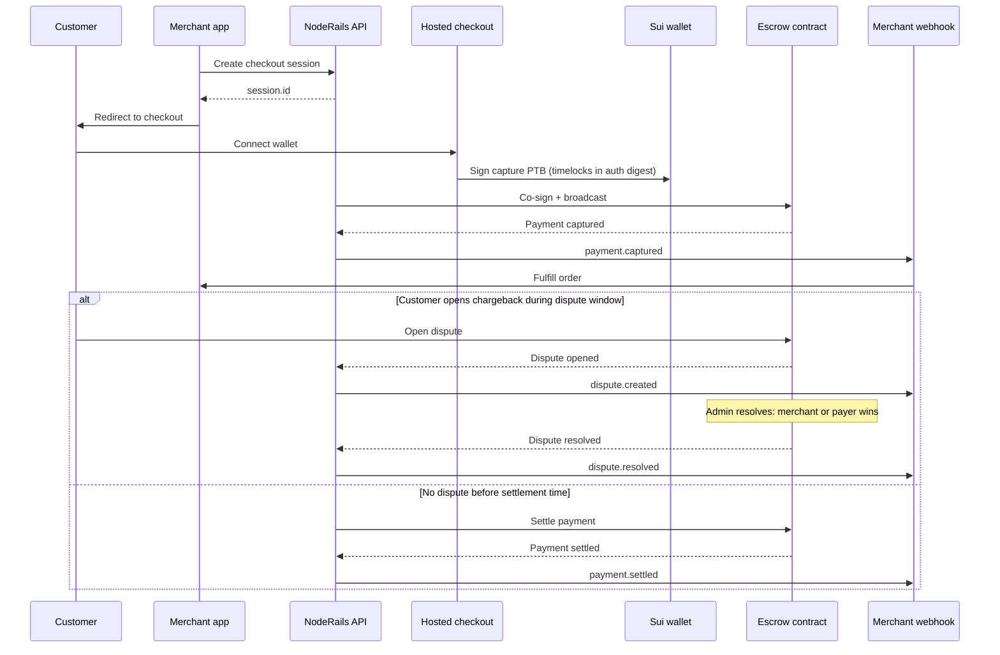
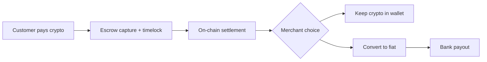
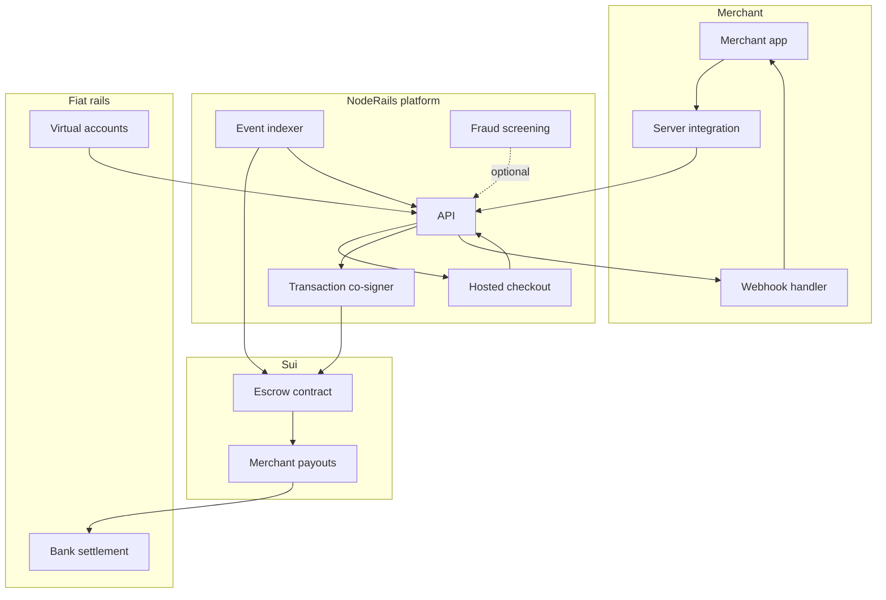

# NodeRails on Sui

**Sui merchant demo:** [Live buy-me-coffee site](http://buy-me-coffee-example-site-noderail.vercel.app/)

Crypto-native payments for merchants who want Stripe-like checkout without giving up on-chain settlement guarantees.

---

## The problem

Accepting crypto payments today forces merchants into bad tradeoffs:

- **Wallet UX is hard.** Customers must understand gas, coin types, and transaction building. Most checkout flows break before payment completes.
- **No real buyer protection.** Card networks have chargebacks. On-chain payments usually have none. If a customer gets scammed or a merchant never delivers, funds are gone with no structured resolution path.
- **No settlement delay model.** Merchants cannot hold funds in escrow while delivery or fulfillment is confirmed. Everything settles instantly or not at all.
- **Backend integration is fragmented.** Merchants stitch together RPC calls, custom PTBs, indexers, and webhook handlers with no shared payment semantics.
- **Trust boundaries are unclear.** Without explicit auth messages and escrow rules, it is difficult to audit who authorized what and when funds move.

Merchants need a platform that handles checkout, co-signing, indexing, and webhooks while keeping money rules enforceable in Move.

---

## Core features

These are the primitives NodeRails is built around. They are enforced on-chain in the escrow contract, not just in application code.

### On-chain chargebacks (dispute resolution)

NodeRails brings card-style buyer protection to crypto. After capture, funds sit in escrow. During a configurable **dispute window**, the payer can open a chargeback on-chain. Platform admins resolve the dispute: merchant wins (funds settle to merchant) or payer wins (funds return to payer). This is the first structured chargeback flow native to Sui escrow payments.

### Enforced timelocks

Every payment carries a 32-byte timelock payload baked into the capture auth message and stored on-chain. It defines three absolute timestamps:

| Phase | What happens |
|-------|----------------|
| **Capture** | Funds move into escrow |
| **Dispute window opens** | Payer can initiate a chargeback |
| **Settlement** | If no open dispute, funds auto-settle to merchant wallet |

Timelocks are validated at capture, checked before refunds, and gate when settlement and disputes are allowed. Auto-settlement runs after capture; merchants can also settle directly on-chain once the timelock expires.

### Escrow capture and settlement

Payments follow a full lifecycle: **authorize, capture, settle**. Capture locks funds in escrow with platform fee routing. Settlement splits merchant amount and platform fee, then releases to the merchant address. Refunds are allowed before settlement if no dispute is open.

### Subscription wallets

Customers fund an on-chain wallet object with per-merchant rules: remaining budget, max per charge, and expiry. Recurring charges pull from the wallet via platform co-signing without the customer signing every billing cycle.

### Auth-bound PTBs

Every capture, wallet subscription charge, and sensitive operation requires an Ed25519 personal-message digest. The digest includes payment intent ID, merchant, amount, fee, and **timelocks**. Merchants and auditors can verify exactly what the customer and platform authorized.

### Hosted checkout and payment links

Redirect-based checkout, shareable payment links, checkout sessions, invoices, and subscription plans. Merchants integrate from their server via the NodeRails API.

### Gas sponsorship

The platform co-signs and broadcasts PTBs so customers are not blocked by gas or PTB assembly. Sponsored capture flows let the wallet sign payment intent while the platform handles execution.

### Event indexing and webhooks

On-chain events (`PaymentCaptured`, `PaymentSettled`, dispute events) are indexed and delivered as signed webhooks (`payment.captured`, `payment.settled`, `dispute.created`, `dispute.resolved`, `subscription.activated`) to merchant backends.

### Wallet fraud screening

Optional pre-checkout risk scoring (velocity, counterparty fan-out, large transaction signals).

### Virtual accounts (fiat onramp)

Merchants can open dedicated virtual receiving accounts in local currencies so customers and partners pay via familiar bank rails instead of crypto. Supported account regions include **USD**, **EUR**, **MXN**, **BRL**, **GBP**, and **COP**, with local payment methods such as ACH, Wire, FedNow, SEPA, SPEI, Pix, and Faster Payments. Deposits reconcile in one dashboard. Identity verification (KYC/KYB) runs before accounts are issued.

### Settle to bank (fiat offramp)

After crypto payments clear escrow and the settlement timelock, merchants can convert balances into fiat and payout to a verified business bank account. NodeRails routes payouts through **100+ countries** and **120+ currencies** with transparent FX and payout pricing designed to keep total cost low. The goal is simple: **accept crypto, settle to bank at the lowest fees.**

- Competitive FX and payout fees vs traditional offramps
- One continuous flow from on-chain capture to bank deposit
- Webhook status for every settlement transfer
- Built for merchant treasury, not consumer deposit accounts
- Sanctions and compliance screening on fiat rails

---

## The solution

NodeRails is a merchant payment platform built on Sui that combines:

- Hosted checkout and payment links
- Move escrow with timelocks and on-chain chargebacks
- Subscription wallets for recurring billing
- Platform co-signing and gas sponsorship
- Virtual accounts for local fiat receiving
- Settle to bank in 100+ countries at competitive fees
- Indexer-driven webhooks for async fulfillment
- Server-side API for merchant integration

---

## How it works

1. **Merchant server** creates a checkout session or payment link.
2. **Customer** opens hosted checkout, connects a Sui wallet, and signs a capture PTB. The auth digest includes timelocks for dispute and settlement windows.
3. **Platform** co-signs and broadcasts. Gas can be sponsored so the customer only signs payment intent.
4. **Escrow contract** records the payment as captured, holds funds, and emits a capture event.
5. **Dispute window.** If the customer opens a chargeback during the window, status moves to disputed and admin resolution decides the outcome. If no dispute, the timelock reaches settlement time.
6. **Settlement.** After the settlement timelock, funds release to the merchant (minus platform fee) automatically or on-chain. Merchants can also trigger settlement directly.
7. **Indexer** picks up on-chain events and the platform fires signed webhooks.
8. **Merchant backend** verifies webhook signatures and fulfills the order.

Funds in escrow can only go to the merchant or back to the payer. No third-party drain path exists in the contract.

---

## User flow

### One-time payment with timelock and chargeback window



### Subscription

1. Merchant creates a product plan and subscription (or payment link tied to a plan).
2. Customer funds an on-chain wallet and authorizes recurring charges for a merchant.
3. Platform co-signs subscription captures against wallet balance and rules (budget, max per charge, expiry).
4. Merchant receives `subscription.activated` and subsequent billing webhooks.

### Refund

Before settlement timelock expires and while no dispute is open, merchant or platform can refund funds to the payer.

### Crypto to bank treasury flow



1. Customer pays in crypto through hosted checkout.
2. Funds clear escrow after capture, dispute window, and settlement timelock.
3. Merchant holds crypto on-chain or triggers a fiat offramp.
4. Fiat converts at competitive rates and lands in a verified business bank account.
5. Webhooks track payout status end to end.

For fiat-first flows, virtual accounts work in reverse: customers send local currency to a virtual account, NodeRails reconciles the deposit, and merchants can route float into checkout or treasury as needed.

---

## Technical architecture



### Payment state machine (on-chain)

```
CAPTURED --> SETTLED        (settlement timelock reached, no dispute)
CAPTURED --> DISPUTED       (payer opens chargeback in dispute window)
CAPTURED --> REFUNDED       (refund before settlement)
DISPUTED --> SETTLED        (merchant wins resolution)
DISPUTED --> REFUNDED       (payer wins resolution)
```

### Chain IDs

| ID | Network |
|----|---------|
| `201` | Sui devnet |
| `202` | Sui testnet |
| `203` | Sui mainnet |

Token keys follow `{SYMBOL}-{CHAIN_ID}` (e.g. `SUI-202`, `USDC-202`).

### End-to-end data flow

```
Create checkout session
  -> customer signs capture (timelocks in auth digest)
  -> platform co-signs and broadcasts
  -> escrow holds funds + capture event
  -> webhook payment.captured + merchant fulfill
  -> [dispute window: optional chargeback]
  -> settlement timelock expires
  -> settle + payment.settled webhook
```

Move owns money rules and state transitions. The platform composes transactions, schedules timelocks, indexes events, and exposes merchant APIs.
